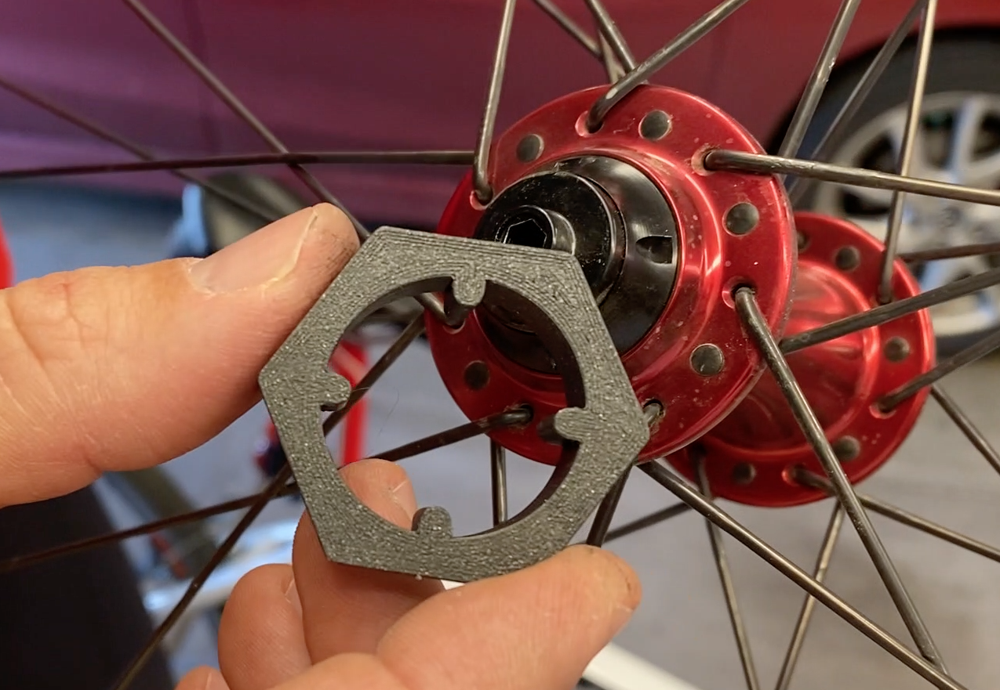

# Chris King Tools

## Summary

Bearing pre-load tool based on the Chris King [Cone Adjusting Tool](https://chrisking.com/collections/hub-tools/products/cone-adjusting-tool).

Video Demo (https://www.youtube.com/watch?v=-1BgzFUTxxI)

## Print Settings

Print on draft mode w/0.3mm layer height to get a stronger part.
Insure that there are enough shells to fill the width of the pins solid (the pins must be strong).

## Post-Printing Installation

To adjust the R45 front hub:
1. Per [Chris King Quick Release Front Hub Adjustment](https://www.youtube.com/watch?v=EI9qNj4CjPM), use a vise to loosen the two 5mm ends of the hub.
1. Use the tool to tighten the adjusting cone finger tight. The axel should spin freely without play.
1. Torque axle end to 110in lbs. (12.4 Nm). Hold the adjusting cone in place while tightening.
1. Go ride it.

## How I Designed This

Manually took measurements off of my Chris King R45 front hub.